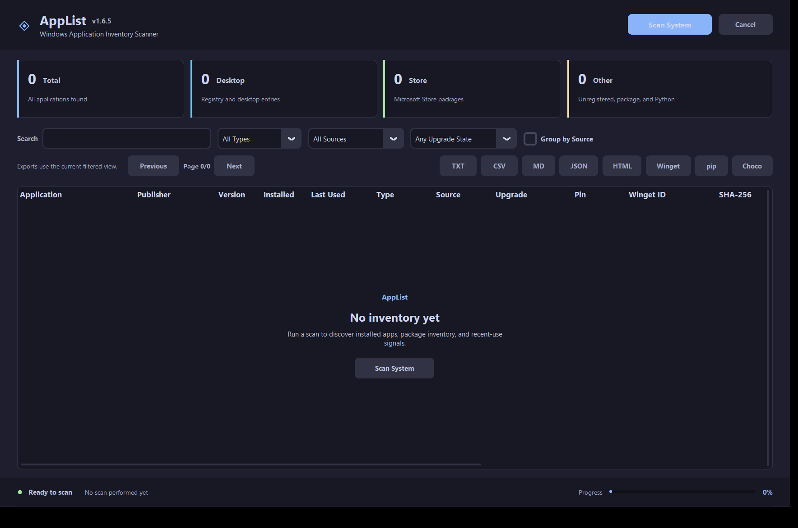

# AppList

  

A Windows application inventory tool for scanning, cataloging, comparing, and exporting installed software before migrations, rebuilds, audits, and reinstall planning.



## Features

### Comprehensive Scanning
- Registry uninstall keys from HKLM 64-bit, HKLM 32-bit, and HKCU
- Microsoft Store / AppX packages via PowerShell
- Program Files discovery for unregistered desktop apps
- Chocolatey, Scoop, and Python pip package inventories
- Locale-safe Winget cross-reference for package IDs, update availability, and pin status
- Last-used date enrichment from UserAssist and Windows Prefetch evidence when accessible
- SHA-256 hashing of discovered executables with cached VirusTotal report links

### Detailed Information Captured
- Application name, publisher, version, install date, last-used date, source, type, architecture, and size
- Install location, executable path, registry uninstall key, and uninstall command
- Winget package ID, upgrade status, pin status, and missing-path flag
- SHA-256 hash and VirusTotal report URL when a primary executable can be identified

### Premium Interface
- Catppuccin Mocha dark theme
- DPI-aware Windows title bar integration
- Threaded scans with live progress and cancellation
- Sortable table with Application, Publisher, Version, Installed, Last Used, Type, Source, Upgrade, Pin, Winget ID, SHA-256, VirusTotal, Size, Arch, Location, and Registry Key columns
- 500-row table pagination for large inventories while exports still include the full filtered result set
- Optional source-grouped view with expandable/collapsible source sections
- Live search across names, publishers, versions, paths, sources, types, and Winget IDs
- Type, source, and upgrade/data-quality filters
- First-run, scanning, no-match, error, and empty-result states
- Context menu actions that disable when unavailable

### Export Options
- TXT report
- CSV spreadsheet export
- Markdown grouped report
- JSON snapshot for machine-readable diffing
- HTML self-contained searchable dashboard
- Winget import JSON
- pip `requirements.txt`
- Chocolatey `packages.config`

### Diff / Compare
- Compare two AppList JSON snapshots and report Added, Removed, and VersionChanged entries
- Run from CLI: `python AppList.py --diff old.json new.json`
- Output to file: `python AppList.py --diff old.json new.json -o diff_report.txt`
- Output as JSON: `python AppList.py --diff old.json new.json -o diff_report.json`

## Installation

### Prerequisites
- Windows 10/11
- Python 3.8 or higher

### Run the Application

```bash
py -m pip install -r requirements.txt
python AppList.py
```

Or double-click `AppList.py` in Windows Explorer after dependencies are installed.

## Usage

1. Launch the application
2. Click **Scan System** to begin comprehensive scanning
3. Use search and filters to narrow the inventory
4. Click column headers to sort
5. Right-click any item for context menu actions
6. Double-click to open the install location
7. Export the filtered view as TXT, CSV, Markdown, JSON, HTML, Winget, pip, or Chocolatey output

### CLI Mode

```bash
python AppList.py --export csv --output apps.csv --include store,winget
python AppList.py --export html --output dashboard.html
python AppList.py --export pip --output requirements.txt --include pip
python AppList.py --export choco --output packages.config --include choco
python AppList.py --diff old_snapshot.json new_snapshot.json
python AppList.py --diff old.json new.json -o report.json
```

Supported export formats: `txt`, `csv`, `md`, `markdown`, `json`, `winget`, `html`, `pip`, `choco`.

Supported source filters: `all`, `desktop`, `registry`, `store`, `program_files`, `chocolatey`, `scoop`, `pip`, `winget`.

### Tests and Local Build

```bash
python -m unittest discover -s tests
powershell -ExecutionPolicy Bypass -File tools/build_exe.ps1
```

The build script creates `dist/AppList.exe` locally with PyInstaller and uses a local code-signing certificate when one is available.

## Export Formats

### TXT Format
Human-readable report with generation timestamp, total count, and full details for each application.

### CSV Format
Spreadsheet-ready rows with application identity, install metadata, source/type data, Winget ID, update status, and pin status.

### Markdown Format
GitHub-ready grouped report for Desktop, Store, Unregistered, Chocolatey, Scoop, Python, and any other detected app types.

### JSON Format
Full AppList schema with machine name, generation timestamp, and application records for round-trippable snapshot diffing.

## Tips for Windows Reinstallation

1. Run a full scan before reinstalling Windows
2. Export Markdown for reading and JSON for diffing
3. Use Winget IDs to reinstall apps with `winget install <ID>`
4. Use CSV in Excel to track reinstall progress
5. Keep install locations for apps that require custom paths

## Technical Notes

- Modular package layout with scanner, export, CLI, model, constants, and GUI modules
- Runs with elevated privileges for complete registry access
- Filters system components, Windows updates, framework packages, and duplicate entries
- Parses UserAssist and Prefetch activity on a best-effort basis for last-used timestamps
- Caches executable SHA-256 hashes in `%APPDATA%\AppList\wingetlist-sha-cache.json`
- Uses `Microsoft.WinGet.Client` on PowerShell 7+ for structured winget package data, with JSON and locale-aware `winget.exe` fallback
- DPI-aware rendering
- Thread-safe scanning with cancellation support
- Local PyInstaller build script for single-file Windows executable generation

## License

MIT License - Free for personal and commercial use.

---

*AppList v1.6.6*
